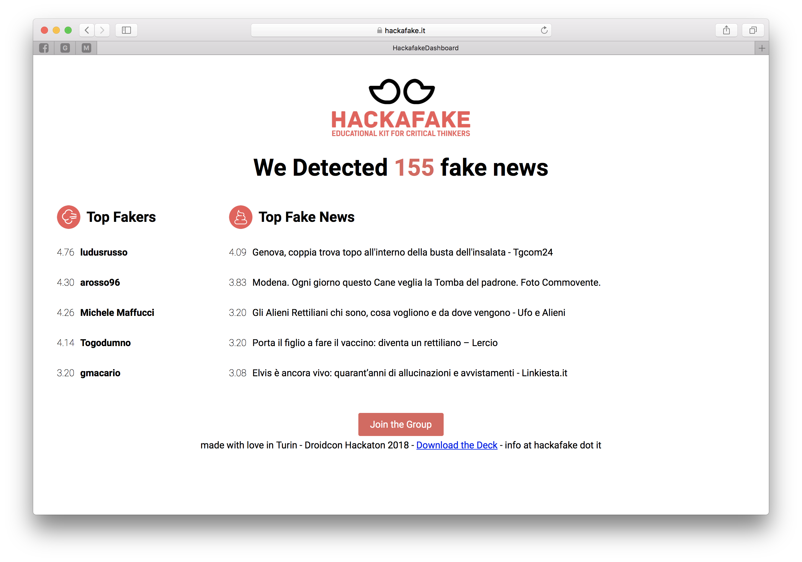

# hackafake-dashboard



The HACKAFAKE Dashboard is a webapp that consumes the [HACKAFAKE web API](https://api.hackafake.it) and displays information from the collected data.

## Development server

### Preparation

Install Angular Development Environment as explained at <https://angular.io/guide/quickstart>

1. Install [Node.js and npm](https://nodejs.org/en/download/) if they are not already on your machine. Verify the correct installation with the following commands:

    ```shell
    node --version
    npm --version
    ```

2. Install Angular CLI

    ```shell
    sudo npm install -g @angular/cli
    ```

### Running the server

Type `ng serve` for running a development server.

Navigate to <http://localhost:4200/>.

The app will automatically reload if you change any of the source files.

## Code scaffolding

Type `ng generate component component-name` to generate a new component.

You can also use `ng generate directive|pipe|service|class|guard|interface|enum|module`.

## Build

Type `ng build` to build the project.

The build artifacts will be stored in the `dist/` directory.

Use the `-prod` flag for a production build.

## Running unit tests

Type `ng test` to execute the unit tests via [Karma](https://karma-runner.github.io).

## Running end-to-end tests

Type `ng e2e` to execute the end-to-end tests via [Protractor](http://www.protractortest.org/).

## Further help

To get more help on the Angular CLI use `ng help` or go check out the [Angular CLI README](https://github.com/angular/angular-cli/blob/master/README.md).

<!-- EOF -->
